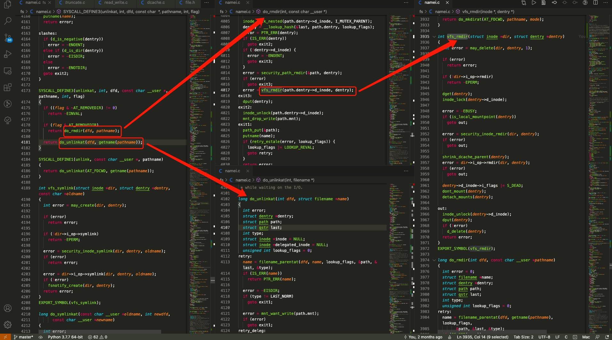

# vscode 函数调用栈分屏插件

## 需求分析

linux的函数调用层级很深，如果能按调用层级依次向右侧分屏展示会比较清晰
该插件包含下列基本功能点：

1. 某种操作触发函数的查询，自动向右展开分屏，分屏与调用函数绑定（不关注所有的代码，只关注用户所关注的）
2. 同一层级的多个函数调用（如if导致的分支），展示在同一分屏层级，如下图中的第二屏，同一层级中的每个分屏显示大小默认等分

因为调用分支的存在，多级的多分支可能会导致调用关系混乱，需要一些强调层级关系的功能：

1. 顶部的状态栏可以根据鼠标focus的分屏自动显示当前的调用栈
2. 支持以某种方式高亮调用栈上的所有分屏，高亮的形式可能有每个分屏的显示的内容调整为分屏对应的函数，增大调用栈上的分屏在该层级分屏中的大小比例
3. 最左侧sidebar新增一个icon，可以显示所有当前已打开的所有调用链

## 学习资料

[官方文档](https://code.visualstudio.com/api/get-started/your-first-extension)

[官方实例](https://github.com/microsoft/vscode-extension-samples)

## 会议纪要
### 2021-2-18

[jiebaomaster](https://github.com/jiebaomaster)

1. 确定打开下一级窗口的显示位置的方法

[lemon-0615](https://github.com/lemon-0615)

1. 触发分屏的api
2. 屏幕显示区域定位api
3. 在1-2_1-3操作之后，打开2_2

[UltraviolenceCYX](https://github.com/UltraviolenceCYX)

1. 侧边栏api
2. 侧边栏的数据显示
3. todo 重新打开vscode之后保留上次的窗口状态
